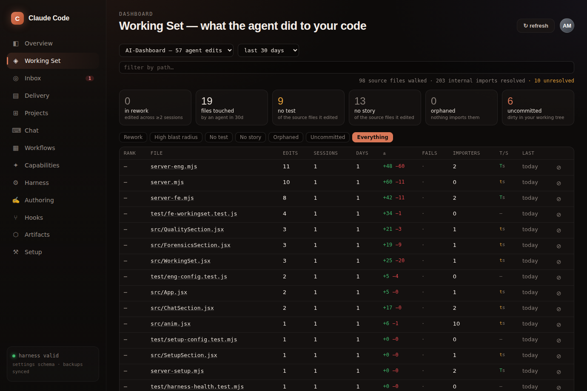
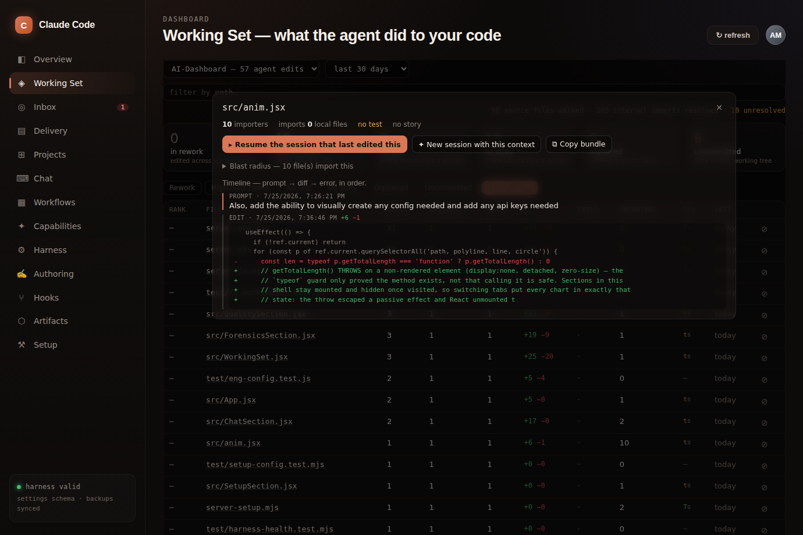
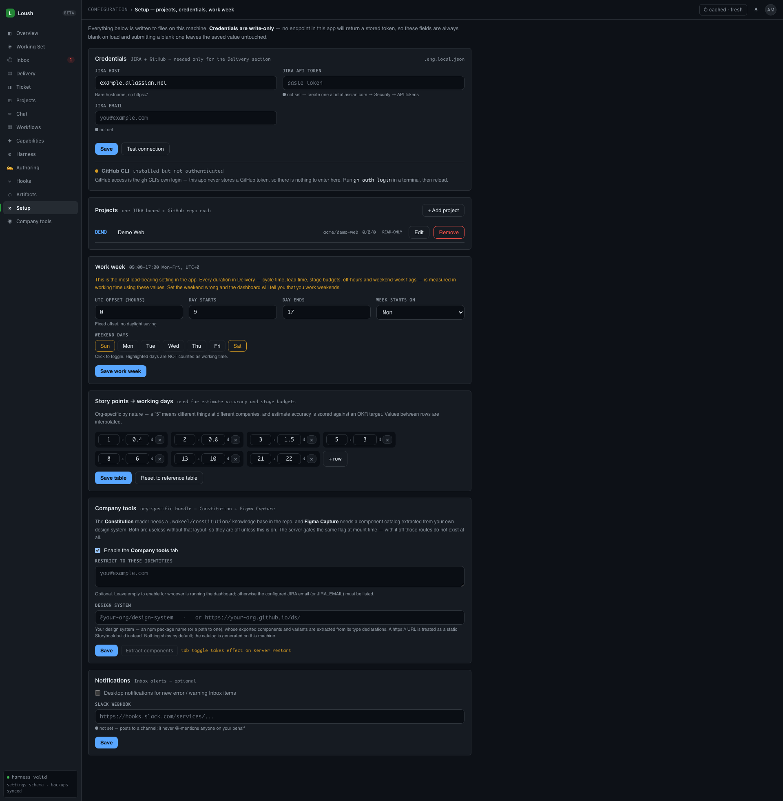
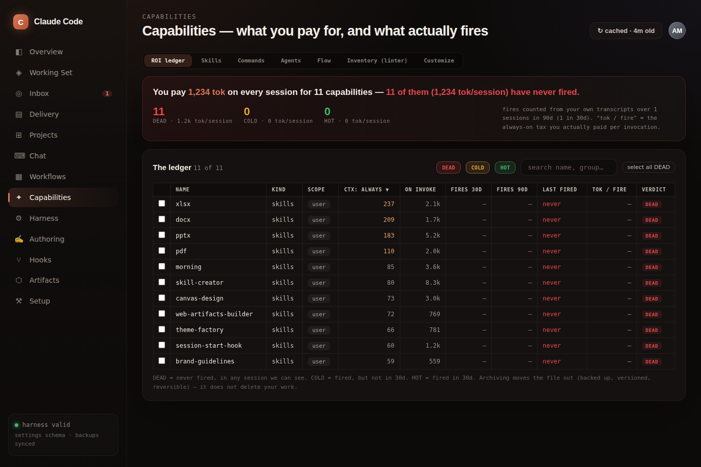
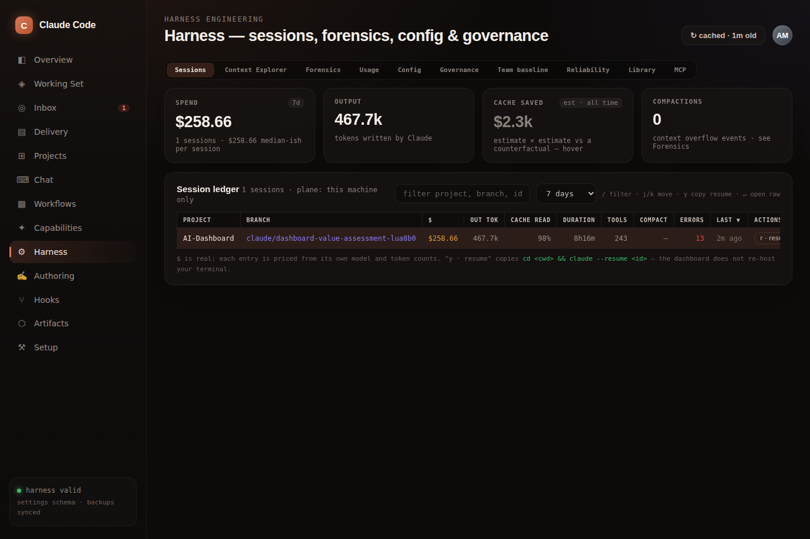
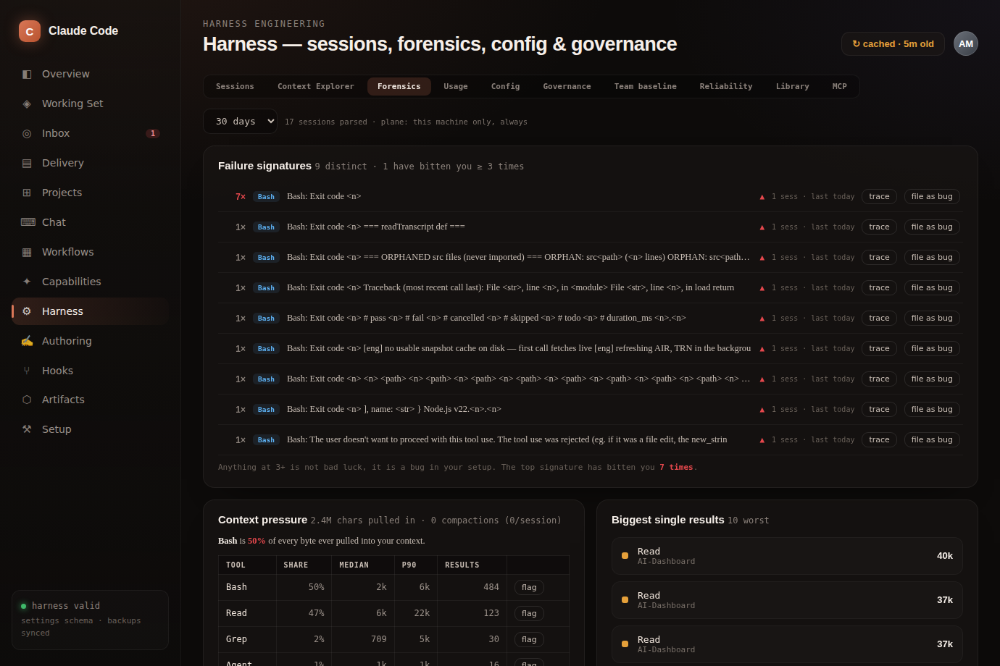
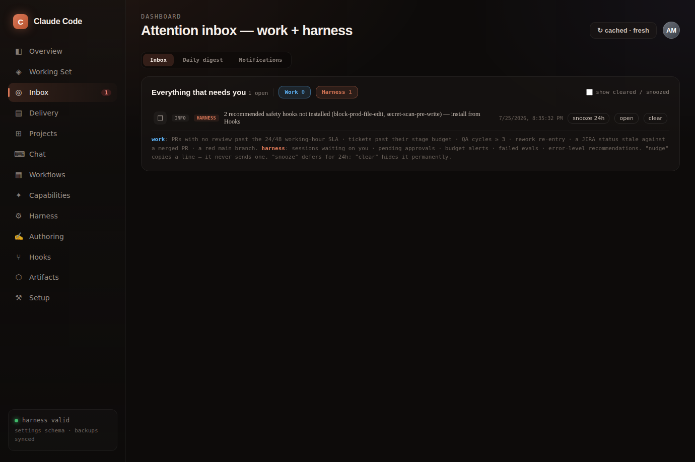
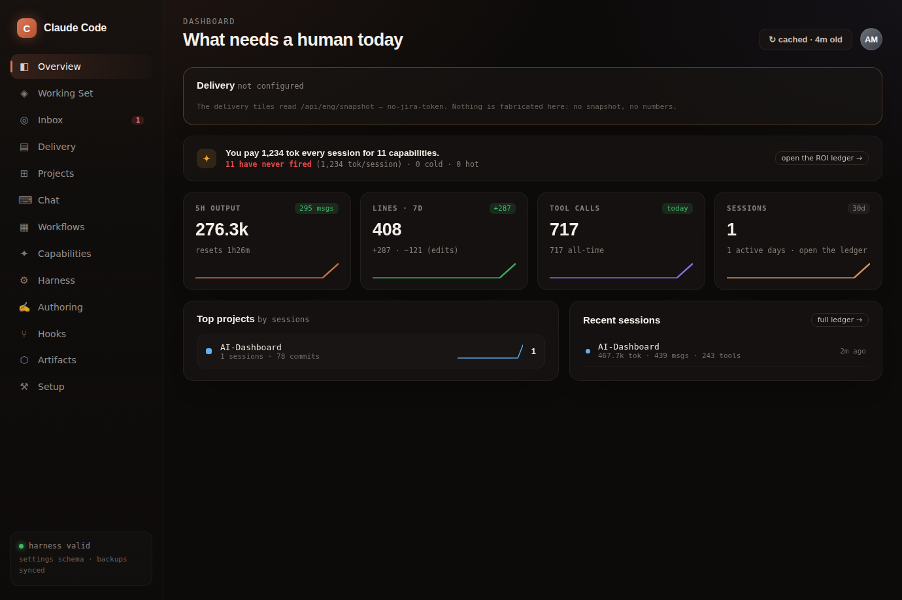
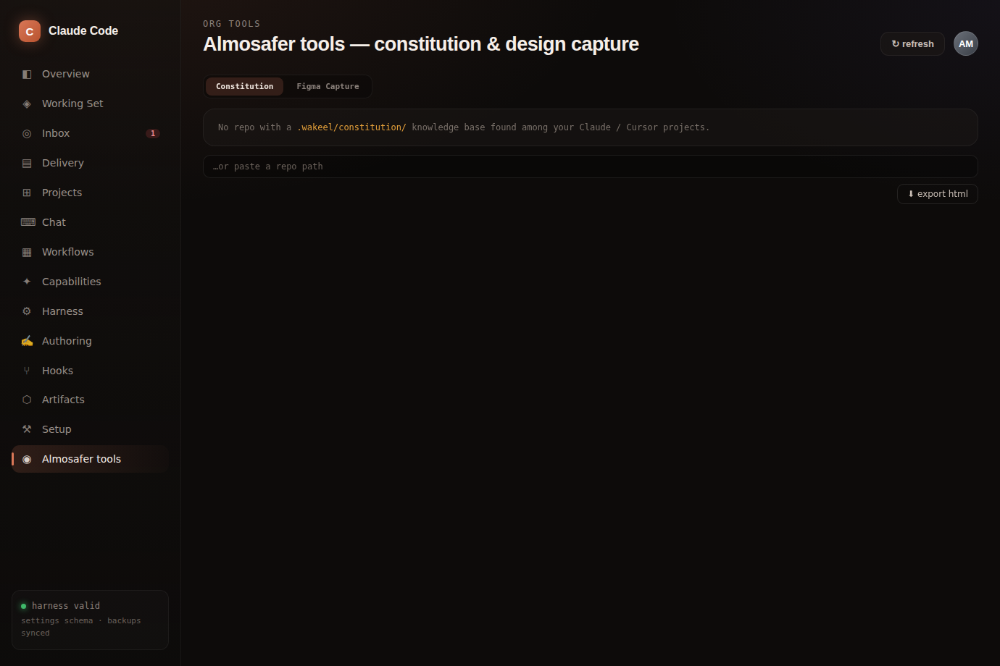

# Loush Dashboard

A local web UI for the real files and real history behind your Claude Code setup. Not a mock: every
write goes to the actual config file, with a timestamped backup taken first, and every number is
computed from transcripts and repos on your own disk.

**The one thing it does that nothing else can.** Your `~/.claude/projects/**/*.jsonl` transcripts
contain the full record of what an AI agent did to your codebase — every edit, with the file path,
the diff text, the prompt that caused it, and the errors it hit on the way. That history is on your
laptop and nowhere else. GitHub cannot see it, Linear cannot see it, Sentry cannot see it, and your
IDE does not keep it. This dashboard joins that record to the code it happened to.

```
npm install
npm run dev          # http://localhost:5177 (Vite) → API on :5178 (Express)
```

Nothing needs configuring to start. **Working Set**, **Capabilities**, **Harness**, **Projects**,
**Chat**, **Workflows** and **Hooks** all work five minutes after install with zero external
services. JIRA and GitHub are needed only for the **Delivery** section, and it says so plainly rather
than rendering empty charts.

---

## The tour

<!-- This is an animated WebP, not a video, and that is deliberate: github.com's CSP allows media
     only from its upload-attachment hosts, so an .mp4 committed to a repo will never play inline
     in a README no matter how it is embedded. An image will. The full recording is the link. -->


Twenty seconds sampled from the [full three-minute tour](docs/screenshots/showcase.mp4) — 15
sections and 40 panels, in order, against a real install: live transcripts, a live JIRA board, and
nothing mocked. The CI really is red and the ROI ledger really does say 128 of 183 capabilities
have never fired.

Re-record it after a UI change with `node scripts/showcase.mjs` (needs `npm run dev` already
running). The tour is not scripted: it reads the sidebar, the breadcrumb and the tablists out of the
DOM, so a new section films itself with no edit to the script.

---

## Contents

- [The tour](#the-tour) — the whole app moving, every section, real data
- [Working Set](#working-set--what-the-agent-did-to-your-code) — the flagship, zero config
- [Setup](#setup--every-config-and-credential-visually) — projects, credentials, work week
- [Capabilities](#capabilities--what-you-pay-for-and-what-actually-fires) — the ROI ledger
- [Harness](#harness--sessions-forensics-and-usage) — sessions, forensics, usage
- [Inbox](#inbox--what-needs-a-decision) · [Overview](#overview--what-needs-a-human-today) · [Delivery](#delivery--jira-github-ci)
- [Everything else](#everything-else) — Chat, Workflows, Projects, Hooks, MCP, Artifacts, ⌘K
- [Org-specific tools](#org-specific-tools--behind-a-flag) — Constitution + Figma Capture, flag-gated
- [The two data planes](#the-two-data-planes) — the privacy boundary
- [Honesty rules](#honesty-rules) — why null is never rendered as 0
- [What was removed, and why](#what-was-removed-and-why)
- [API](#api--panels-backing-data) · [Backups](#backups) · [Risks](#risks--mitigations) · [Development](#development)

---

## Working Set — what the agent did to your code



**The problem.** You let an agent work in your repo for two weeks. Which files did it struggle with?
Which did it quietly rewrite six times? Which of the things it touched have no test? If you change
`Button.tsx` now, what breaks? Git cannot answer any of this — git only kept the attempt that
survived, not the four that didn't, and it has no idea which prompt produced any of them.

**What it does.** Joins the Edit/Write `structuredPatch` blocks already in your transcripts — file
path, ±lines, and up to 24 lines of real diff text — to an import graph parsed from the repo on disk.
One row per file an agent **edited** (reads are not evidence of difficulty):

| Column                    | What it tells you                                                                                  |
| ------------------------- | -------------------------------------------------------------------------------------------------- |
| **rank**                  | How much this file has fought you: `revisitSessions×3 + revisitDays×2 + failures×2 + extraEdits×1` |
| **sessions / days**       | How many separate times you came _back_ to it                                                      |
| **fails**                 | Tool errors attributed to that exact file                                                          |
| **importers**             | Blast radius — product code counted separately from tests                                          |
| **t/s**                   | Whether a test or a Storybook story actually covers it                                             |
| **dirty / orphan / gone** | Uncommitted, imported by nothing, or no longer on disk                                             |

The rank is **labelled a heuristic, not a measurement**: every input is in the row and the arithmetic
is on the tooltip. A file edited in exactly one session scores `null`, not 0 — that is work, not
rework, and scoring it 0 would rank it against files we actually have evidence about.

**Why the rank is the interesting part.** A component the agent rewrote six times across four
sessions is a component whose prop API nobody can guess — including you. That is a refactor signal,
and it is invisible everywhere else.

Coverage comes from the import graph, not just filenames: a test that _imports_ the file counts even
when the names share no stem, which naming-convention checks miss.

### The file dossier



Click any file for the causal chain git never recorded: **prompt → diff → error → retry → diff**, in
order, with the real hunk text.

Every row ends in an action, and the actions run **inside the app**:

- **Resume the session that last edited this file** — not a `claude --resume <id>` string to paste
  into a terminal. (Three panels used to hand you that string while the endpoint to do it properly
  had existed all along.)
- **New session with this context** — opens Chat pre-loaded with the file's blast radius, its recent
  diffs, and the tool errors already hit there, so the agent does not rediscover them.
- **Copy bundle**, or **mute** a noisy path so it stops dominating the rank.

**Zero external config.** No JIRA, no `gh`, no team file, no network. Repos are discovered from the
`cwd` recorded in your own transcripts. The walk cap and unresolved-import count are printed on
screen, because a graph that silently truncates is a poster, not an instrument.

---

## Setup — every config and credential, visually



**The problem.** Configuration used to mean hand-editing JSON in three separate places, and the only
reason the app "worked out of the box" was that one company's production config — including ten real
employee email addresses — was compiled into the source and committed to git.

**What it does.** Six panels: **Credentials** (JIRA host, email, API token, with a real _Test
connection_), **Projects** (JIRA key + repo + dev/QA/product rosters + an explicit per-project
**writes** opt-in), the **work week**, the **story-point → days** table, **Company tools** (the
org-specific bundle described [below](#org-specific-tools--behind-a-flag)), and **notifications**.

### How credentials are handled

This is the part worth reviewing, because it is designed against a specific threat:

- **No endpoint ever returns a secret value** — not masked, not partially, not once. The client is
  told `set: true|false` and its source, and nothing else. A token therefore cannot leak through a
  screenshot, a cached response, or the devtools network tab.
- **Fields are always blank on load.** That is the design, not a bug. Submitting a blank field
  _leaves_ the stored value alone; clearing takes an explicit **Remove**. Without that rule, editing
  the email would silently wipe the token — the form has no token to resubmit, because it was never
  given one.
- **Secret files are written `0600`** via atomic temp+rename, and are deliberately **not** copied into
  the backups directory. A "helpful" backup of a credentials file is just a second plaintext copy of
  your token somewhere you forgot about.
- **`.gitignore` is checked on every read**, with a red banner if a secret file is committable —
  exactly the check that would have caught those employee emails before they were pushed.
- It **warns when `JIRA_EMAIL` / `JIRA_API_TOKEN` env vars are set**, because they take precedence and
  would otherwise silently ignore anything you save.
- **GitHub has no token field**, because this app stores no GitHub token — it uses the `gh` CLI's own
  login. The panel says that rather than offering an input that does nothing.

### The work week is the most load-bearing setting in the app

Every duration in Delivery — cycle time, lead time, stage budgets, off-hours and weekend-work flags —
is measured in _working_ time. It was hardcoded to Sun–Thu 10:00–18:00 Asia/Riyadh with no way to
change it, so a US engineer on Mon–Fri 9–5 had their whole Friday counted as weekend work and most of
their day as off-hours. It is now hours + weekend days + UTC offset + week start, and the week
actually in force is echoed in every payload's `provenance`.

Validation rejects inputs that would corrupt downstream maths: a zero-length or inverted day (which
would make every duration `Infinity`), an all-weekend week, out-of-range offsets, a descending
story-point table, a repo that is not `owner/name`, and a JIRA host with a scheme.

**Files written:** `projects.json` and `.eng.local.json` (both gitignored; `projects.example.json` is
the committed template) plus `~/.claude/dashboard-meta.json`.

---

## Capabilities — what you pay for, and what actually fires



**The problem.** Every skill, command and agent you install has a description loaded into context on
_every single session_, forever, whether or not it ever runs. Nothing tells you which ones are
earning that. A perfect-scoring skill that has never fired is worthless; a scruffy one invoked daily
is the most valuable file on your disk.

**What it does.** The ROI ledger counts real invocations from your transcripts and pairs them with
the always-on token cost, headlined _"you pay N tok every session for M capabilities — K of them have
never fired."_ Verdicts have stated thresholds: **DEAD** (never fired, and old enough to have had the
chance) · **COLD** (not in 30d) · **NEW** (installed < 14d ago) · **HOT** (fired in 30d).

> **NEW exists because DEAD used to be unfair.** A skill installed this morning had never fired, so
> it was labelled DEAD alongside one abandoned a year ago, and the headline invited you to archive it.
> The same bug hit `tok / fire`, which multiplied by _every_ session in the 90-day window — including
> the hundreds that ran before the file existed — so a day-old skill was billed 90 days of always-on
> tax. Both are now scoped to the capability's own lifetime.

Then it closes the loop: select rows → **dry-run first** → archive. Backed up, versioned, reversible
— it moves the file out, it does not delete your work.

Also here: Skills / Commands / Agents CRUD, the Flow graph, and the Inventory frontmatter linter —
demoted off the landing page and relabelled **an authoring aid, not a metric**, which is what it
always was.

---

## Harness — sessions, forensics and usage



**Sessions.** A sortable ledger with real per-session `$`, output tokens, cache-read %, duration, tool
calls, compactions and errors. Keyboard layer: `/` focus filter, `j`/`k` move, `r` **resume in-app**,
`y` copy the shell command, `↵` open.
_Solves:_ "what did that expensive session actually cost, and how do I get back into it" — without
grepping JSONL by hand.



**Forensics.** Failure signatures grouped and counted, with a stated decision rule: _anything at 3+ is
not bad luck, it is a bug in your setup._ Plus context pressure by tool, and hook blast radius
(firings / blocks / block rate / p50–p90 latency) with **disable**.

> **Context pressure names its denominator.** The share column was rendered under a context-_window_
> heading while actually measuring share of tool-result **characters** — a different denominator that
> excludes the system prompt, CLAUDE.md, user turns and assistant output, i.e. several of the window's
> largest occupants. The field is now `shareOfToolBytes`, characters are converted to an explicitly
> labelled token _estimate_ (÷4), and a tool with no recorded results shows `—` rather than a median
> of 0.
> _Solves:_ the same tool error bites you weekly and you never notice, because each occurrence looks
> like a one-off. Grouping by normalized signature makes "this has cost you 181 times" visible — and
> there is a **file as bug** button next to it.

> **On the "flag this tool" button.** It used to be called _cap_, and its hook told the model the
> result had been "truncated to 20k". It truncated nothing — a `PostToolUse` hook cannot shorten a
> result the model already received. So it _added_ tokens to an oversized context and lied to the
> model about what happened. It now warns honestly and says what to do instead.

**Context Explorer.** Replay any session's context-window occupancy turn by turn — each point is one
assistant turn's total prompt size straight from the usage block, plotted against the 200k/1M budget
with detected `/compact` resets marked.
_Solves:_ "why did this session compact three times" — visible instead of guessed.

**Usage.** A harness health score (A–F), month-end cost projection against an editable budget, a
usage-anomaly table (days spiking >2× the trailing baseline — a runaway-agent tell), the 18-week
output-token heatmap, tool and model bars.

> **The grade can say "I don't know".** Two of its three factors used to return a score of 50 when
> they had no data, entering the weighted mean as if measured — so a brand-new install scored **D**,
> one turn scored **F**, and a single good day flipped it to **A**. Factors with no data are now `na`
> and dropped from the mean; below 25 turns there is no grade at all. `contextEfficiency` is flagged
> as resting on an _assumed_ constant, because it is.

Also in this section: Config (settings.json editor), Governance (versions, drift, rollback),
Reliability, Library, MCP and Team baseline.

---

## Inbox — what needs a decision



**The problem.** Signals that need a human are scattered across GitHub, JIRA, CI and your own harness,
and none is individually urgent enough to interrupt you.

**What it does.** One severity-sorted list with two plane chips (**work** / **harness**). Work items:
PRs with zero reviews past the 24/48 working-hour SLA, tickets past their stage budget, ≥3 QA cycles,
rework re-entry, a JIRA status stale against a merged PR, a red main. Per row: **nudge**, **snooze
24h**, **open**, **clear**. Drives the sidebar badge, a 60s poll, and optional desktop/Slack push.

**Nudge copies a line; it never sends anything.** Deliberate: this app does not message your
colleagues on your behalf. The Slack push posts to a _channel_ and never @-mentions a person.

---

## Overview — what needs a human today



Five delivery tiles (in flight, shipped 30d, cycle p50/p90, at-risk commitments, review queue), a
cross-repo CI strip that goes red when a default branch is red, the capability-ROI headline, harness
KPIs, top projects, recent sessions and recalled memory.

The screenshot above is an **unconfigured install**, and it is here on purpose: the delivery tiles
need JIRA + `gh`, so they say _"Nothing is fabricated here: no snapshot, no numbers"_ instead of
rendering a green zero. That is the rule the whole app is held to.

---

## Delivery — JIRA, GitHub, CI

**The problem.** Cycle time, review latency and escaped defects live in three systems, and nobody
computes them the same way twice.

**What it does.** Tabs: **Engineering** (Attention Queue, Review flow with PR pickup-time and PR-size
distributions, Quality, Investment, Predictability, Epics, CI, Load, Board, Members, OKRs, Export),
**Idea → prod funnel** (median working-days per stage, headlined by _lead time − cycle time = "time
it sat waiting on us"_), **DORA** (deployment frequency + lead time against Google Cloud's
elite/high/medium/low bands — change-failure-rate and MTTR render as honest "no data source" cards
rather than a fabricated proxy), **AI ROI** (cohort only, paired with a rework-rate guardrail), and
**1:1 prep**.

CI failures now have a **re-run failed** button. (`POST /api/ci/rerun` shells `gh run rerun`, was
documented, and had zero callers anywhere in the UI — the panel that showed you the red run could not
re-run it.)

**Requires configuration:** JIRA credentials + an authenticated `gh`. Without them the section reports
`available: false` and explains why.

---

## Everything else

| Section                        | What it does                                                                                                                                                                                           | Problem it solves                                                                                     |
| ------------------------------ | ------------------------------------------------------------------------------------------------------------------------------------------------------------------------------------------------------ | ----------------------------------------------------------------------------------------------------- |
| **⌘K palette**                 | Jump anywhere, and search everything Claude ever said, ran or edited — prompts, assistant text, bash commands, Edit hunks — filterable by kind and **by file path**                                    | _"What has Claude ever done to `src/auth.ts`?"_ — a question no other tool on your machine can answer |
| **Chat**                       | Talk to Claude Code from the browser; resume any session; per-turn memory grounding with `[memory:<name>]` citations; ✓/✗ review trail written to disk                                                 | Steering agent work without a terminal, with "a human checked this" recorded rather than assumed      |
| **Chat Insights**              | One-shot rate, cost/chat, day×hour heatmap; duplicate-prompt clustering (exact + Jaccard) with **save as command**                                                                                     | You retype the same prompt weekly — this finds it and turns it into a `/command`                      |
| **Workflows → Quick Actions**  | One-shot `claude -p "/command"` against a chosen project, streamed live, result dropped in the Inbox                                                                                                   | Running `/code-review` or `/security-review` without leaving what you're doing                        |
| **Workflows → Task Board**     | Agentic kanban: isolated git worktree per ticket, headless dev agent, manual review/QA/release gates, merge queue, first-class **Blocked** state you can reply to inline                               | Supervising several agent tasks at once without them colliding in one working tree                    |
| **Workflows → Bugs**           | Paste a trace; file paths and stack frames auto-extracted; **auto-bisect** runs real `git bisect` against your repro command and names the culprit commit                                              | Finding the offending commit without babysitting a bisect                                             |
| **Workflows → Quality**        | Analytics-event registry + taxonomy lint; **design drift** vs a manifest; `/review` history parsed from transcripts with a recurring-finding detector                                                  | Catching bad event names and prop drift before they land                                              |
| **Projects**                   | Card per project Claude Code has opened: running-now indicator, sessions, token usage, most-used model, roadmap progress, its own skills/commands/agents/MCP                                           | Seeing which projects the agent is actually active in                                                 |
| **Skills / Commands / Agents** | CRUD with CodeMirror, frontmatter preview, "what triggers this", template scaffolding                                                                                                                  | Authoring capability files without hunting for paths                                                  |
| **Hooks**                      | Per-scope visual list, **matcher tester** (live regex vs a sample tool), **dry-run** (executes the real command with a sample payload → allow/BLOCK/latency), health from transcripts, pattern library | Hooks are invisible until they misfire; this makes them testable _before_ they block your work        |
| **MCP**                        | JSON editor per server + **Test connection** that actually speaks MCP (JSON-RPC `initialize`, reports latency and server version)                                                                      | Distinguishing "unreachable" from "reachable but needs OAuth" — the state everyone gets wrong         |
| **Governance**                 | Versioned writes, drift vs a baseline bundle, rollback, batch ops across projects                                                                                                                      | Undoing a config change you cannot remember making                                                    |
| **Artifacts**                  | Read-only scan of `~/.claude` with rename/delete and per-type viewers                                                                                                                                  | Finding what is actually taking up space                                                              |
| **Authoring**                  | Prompt Studio: compose, expand `$ARGUMENTS`, save as a command                                                                                                                                         | Iterating on a prompt before committing it                                                            |

**Design drift, honestly.** `POST /api/design/manifest` bootstraps a manifest _by scanning the code_ —
so diffing it against that same code is diffing a file against a photocopy of itself, and drift is
zero by construction. The endpoint now reports `status.state = "baseline-only"` and the UI shows
_"cannot detect drift yet — 0 of N components have design-side data"_ instead of a green "code and
manifest agree". Variant drift is now checked for real; that loop's body used to be a bare
`continue`.

---

## Org-specific tools — behind a flag



**The problem, and the mistake.** Two features assume one organisation's repo layout: the
**Constitution** reader needs a `.wakeel/constitution/` knowledge base, and **Figma Capture** ships
against a specific design-system catalog. Shipping them to everyone is what made this app feel like
someone else's tool — every user got a sidebar entry that rendered a 404 string. But _deleting_ them
was also wrong: for the org that has that layout they are load-bearing.

**What it does.** They live in a **Company tools** tab that exists only when `Company_Tools` is
set in `projects.json`. It is **hidden from everyone by default** — there is no nav entry, no route,
and no hint that the feature exists. Only the config turns it on, because a flag that defaults on is
how someone else's tools ended up in everyone's sidebar in the first place.

```jsonc
"Company_Tools": true                                          // enabled for whoever runs it
"Company_Tools": { "enabled": true }                           // same, long form
"Company_Tools": { "enabled": true, "emails": ["you@corp"] }   // also require an identity match
```

With `emails` set, the flag only opens for those identities — the configured JIRA email, or
`JIRA_EMAIL` from the environment. There is a toggle for all of this in **Setup → Company tools**.

**Figma Capture needs your design system, and no design system ships with this app.** Name yours and
the component picker is built from it — exported components and their variants read straight out of
the package's type declarations:

```jsonc
"designSystem": { "package": "@your-org/design-system" }        // node_modules, or a path
"designSystem": { "storybook": "https://your-org.github.io/ds/" }  // a static Storybook build
```

Hit **Extract components** in **Setup → Company tools**, or run `npm run catalog:refresh`
(`-- --package @your-org/design-system` for a one-off). The generated `design-system-catalog.json` is
gitignored: it describes your design system, not this app, so it is built per machine and never
committed. With nothing configured the picker falls back to free text, which still works.

**The gate is at mount time on the server, not just in the nav.** With the flag off,
`/api/constitution/*`, `/api/atoms/*` and `/api/figma-capture/*` are never registered, so a stale
client cannot reach them — it gets a real 404 rather than a route that should not be there. The
client reads `GET /api/features` to decide which nav entries exist. Changing the flag takes effect
on server restart, and the Setup panel says so.

- **Constitution** — reads a repo's `.wakeel/constitution/` knowledge base: clause coverage, the
  citation graph, artifact drill-down, and a grounded ask-the-project search.
- **Figma Capture** — pulls a frame's screenshot and node tree from a Figma link, lets you annotate
  regions with design-system component mappings, and writes a `context.md` that guides Claude when
  implementing the design.

---

## The two data planes

Every panel declares which plane it draws from, and the boundary is enforced in the server, not in
policy.

- **Plane A — work artifacts** (JIRA tickets, GitHub PRs, reviews, CI, bugs). Already visible to
  everyone on the team, therefore safe to show per person. This is Delivery and the `work` half of
  the Inbox.
- **Plane B — harness telemetry** (transcripts, tokens, cost, session hours). **One machine's private
  data, self-only, forever.** No endpoint accepts a machine or user parameter for transcript data and
  none ever will. This is Working Set, Harness, Capabilities and the `harness` half of the Inbox.

The only join is `/api/roi`, which **drops the author/assignee field before aggregating** — cohorts
only, never a person. There is no team-adoption view, no tokens-per-engineer, no cost-per-engineer,
no leaderboard. That is a boundary, not a preference: measure the work (cycle time, escaped defects,
review latency), not the keystrokes.

`test/eng-privacy.test.js` enforces this structurally — it walks payloads for banned fields and fails
the build if one appears.

Two things this app will never do: **auto-nudge** (every nudge copies a line for a human to send) and
**ingest another engineer's transcripts, tokens or active hours**.

---

## Honesty rules

The app is held to four rules. They exist because it previously broke all four.

1. **`null` is never rendered as `0`.** "Not measured" and "measured, and it is zero" are different
   facts, and the idiom `Math.round((n || 0) * 100)` erased the difference wherever it appeared. An
   unknown renders as `—`.
2. **No green tick over an absent source.** A clean bill of health requires having _read_ something.
   An empty bug log now says _"no bugs have been recorded here yet — this is an empty log, not a
   clean bill of health."_
3. **Small samples get no score.** The harness grade needs 25 turns; team aggregates suppress below 5
   contributors; percentile helpers return `null` on empty input rather than 0.
4. **Every heuristic shows its arithmetic.** The Working Set rank prints its weights and inputs. No
   number is a black box, and anything resting on an assumed constant is labelled `assumed`.
5. **A ratio's numerator and denominator must describe the same cohort.** Several did not:
   - **Escape rate** bucketed escaped bugs by the month they were _filed_ against tickets shipped
     that month, so a bug filed today about a release from six months ago landed in today's
     numerator — ship 2 things in a slow month, have 4 old bugs surface, and it reported **200%**.
     An escaped bug now counts against the month **its parent shipped**. Recent months are marked
     `provisional` (bugs have not had time to surface), and if no bug in the window links to a
     parent the rate is `null` — a team that does not link bugs used to score a permanent,
     fabricated **0%**.
   - **`$` per shipped point** divided _this machine's_ Claude spend (plane B is self-only) by the
     _whole team's_ shipped points, so on a ten-person team it read ~10× too low and moved when
     other people shipped. It is now computed over AI-touched shipped tickets only. The old figure
     is still emitted as `selfSpendOverTeamPoints`, named for what it is.
6. **A heuristic must be monotone, or it can be gamed.** **Estimate accuracy** scored finishing 50×
   faster than estimated (51%) as barely better than taking twice as long (50%) — and it fed an OKR
   at ≥85%, so the reliable way to hit the target was to _inflate estimates_. It is now symmetric
   `min/max`: being wrong by the same factor scores the same in either direction, and padding no
   longer helps. **This changes the scale** — 85% now means landing within ~18% of the estimate — so
   a target carried over from the old formula is probably too high and should be re-baselined.
7. **No verdict without a fair sample.** **Bus factor** had no minimum: an area with a _single_
   ticket has exactly one contributor, so it was flagged as a knowledge risk. Below 5 tickets the
   answer is now `null` — unknown, not safe and not risky — and the UI shows `LOW n`.

---

## What was removed, and why

Five adversarial audits of this repo found **32,757 LOC across 4 separate SPA shells and 81 leaf
panels serving about 4 real jobs**, with 48% of frontend modules having exactly one commit — written
once, never revisited. The repo's characteristic verb was _demote_, not _delete_, which is how 81
panels accumulated. These were deleted:

- **Cursor shell** — a second product's analytics inside a Claude Code dashboard: 33 endpoints, zero
  tests, reading Cursor's private SQLite.
- **Career shell** — eleven tabs of self-reported journaling opened at review time, plus the
  `server-team.mjs` surface nothing else mounted. It was the best-tested area in the repo; that
  inversion was the point.
- **Constitution + Atoms** — keyed to a `.wakeel/` layout that does not exist here, so both sections
  rendered a 404 string as their entire tab.
- **Labs** (Mindwalk, Agent Squads, Squad Designer) — the README already called them demos, and
  Mindwalk shelled out to a binary that is not in this repo.
- **Gamification** — XP was all-time assistant _message count_, so the fastest way to level up was a
  long, thrashing, unproductive conversation: the metric rewarded exactly the behaviour the tool
  exists to reduce. It had been deleted once with that rationale and resurrected two commits later
  the same day; `src/App.jsx` carried the tombstone comment three lines below the import that
  contradicted it. The presentational helpers survive as `src/ui/anim.jsx` — motion is not a metric,
  only the scoring was the problem.
- **Figma Capture** and **Constitution** were deleted here too — that part was **reverted**. Both are
  genuinely needed by the org whose layout they assume, so they are back behind the `Company_Tools`
  flag described in [Org-specific tools](#org-specific-tools--behind-a-flag) rather than shipped to
  everyone. The original criticism still stands and is why the flag exists: the design-system catalog
  is a regex scrape of one company's Storybook, and the repo scanner requires a path segment literally
  named `app`, so it finds nothing in a standard `src/components/` layout.
- **`dist/`** — a build artifact that was tracked, so a stale bundle shipped alongside every change.

Kept deliberately, against the audit: `server/memory.mjs` (Overview's recall tile and chat grounding
depend on it) and `lib/harness-health.mjs` / `lib/harness-usage-trends.mjs` (renamed from `career-*`; they
feed the Harness Usage panel, not the deleted career shell).

Demoted rather than deleted: the frontmatter linter (→ Capabilities, as an authoring aid), the
"cache saved $" estimate (→ small type on Sessions; it is an estimate × an estimate against a
counterfactual that never happened, and it only ever goes up), and the 18-week token heatmap (→
Harness ▸ Usage; it measures volume, which is a proxy for "was he typing").

**Net: ~15,300 lines and 100 endpoints removed**, full test suite green, every surviving endpoint
verified `200`.

---

## API — panels' backing data

| Endpoint                                                                                                                                                    | What                                                                                                               |
| ----------------------------------------------------------------------------------------------------------------------------------------------------------- | ------------------------------------------------------------------------------------------------------------------ |
| `GET /api/fe/workingset?root=&days=` · `GET /api/fe/dossier?root=&file=` · `POST /api/fe/mute`                                                              | Working Set: rework rank, import graph, coverage; per-file prompt→diff→error timeline and context bundle           |
| `GET /api/features`                                                                                                                                         | Which optional bundles are mounted (`companyTools`). The client reads this before deciding which nav entries exist |
| `GET /api/constitution/*` · `GET /api/atoms/*` · `/api/figma-capture/*`                                                                                     | Only mounted when `Company_Tools` allows — otherwise these routes do not exist                                     |
| `GET /api/setup` · `PUT /api/setup/{eng,project,credentials,notify}` · `DELETE /api/setup/project` · `POST /api/setup/test/jira` · `GET /api/setup/test/gh` | Visual config. **`GET /api/setup` never returns a secret value** — only `set: true\|false`                         |
| `GET /api/inbox[?plane=work\|harness]` · `POST /api/inbox/done`                                                                                             | Every attention item; `{key,done}` clears, `{key,snoozeHours:24}` defers                                           |
| `GET /api/eng/snapshot?project=all`                                                                                                                         | The plane-A delivery snapshot (JIRA changelog + GitHub PRs), 2h cache                                              |
| `GET /api/ci/health?days=14` · `POST /api/ci/rerun`                                                                                                         | Cross-repo default-branch failure rate, time-to-green, flakes, `mainRed`; re-run a failed run                      |
| `GET /api/capabilities` · `POST /api/capabilities/archive`                                                                                                  | The ROI ledger; archive is dry-run → backed up → reversible                                                        |
| `GET /api/forensics?days=30`                                                                                                                                | Failure signatures · context pressure by tool · hook blast radius                                                  |
| `GET /api/sessions?days=7`                                                                                                                                  | Session ledger with real `$` and a `resume` command per row                                                        |
| `GET /api/context/sessions` · `GET /api/context/:sessionId`                                                                                                 | Context Explorer: replayable-session list, then per-turn occupancy + detected `/compact` events                    |
| `GET /api/usage[?budget=N]`                                                                                                                                 | Token/cost activity, per-model mix, harness health + regression, cache-TTL waste, anomalies, month-end projection  |
| `GET /api/roi?days=90`                                                                                                                                      | Cohort AI $/shipped-point + a cohort rework-rate guardrail. Author/assignee dropped before aggregation             |
| `GET /api/search?q=&file=&kind=`                                                                                                                            | Prompts, assistant text, bash commands, Edit hunks; `?file=` = "only sessions that touched this path"              |
| `GET /api/design/drift?project=` · `POST /api/design/manifest`                                                                                              | Component drift with a `status` that reports when drift is _not_ detectable                                        |
| `GET /api/gov/team` · `POST /api/gov/team/{baseline,export,sync}`                                                                                           | Team harness baseline + per-repo drift                                                                             |
| `GET /api/scheduler` · `PUT /api/scheduler`                                                                                                                 | The cadence-loop config (`{enabled, jobs[]}`); digest / dispatch / remediate. Off by default                       |
| `GET /api/runs[?verdict=]` · `POST /api/runs/approve-batch`                                                                                                 | Runs with an aggregated PASSING/BLOCKED/NEEDS-HUMAN verdict; batch-approve converged runs                          |
| `POST /api/chat-review`                                                                                                                                     | Records a per-output accept/reject review-trail entry                                                              |

---

## Backups

Before **any** destructive write (save, delete, rename overwrite, settings/mcp edits), the current
file — or whole skill directory — is copied to:

```
~/.claude/dashboard-backups/<ISO-timestamp>__<full~path~with~tildes>
```

Nothing auto-prunes this directory; clean it out yourself occasionally.

**Credentials are the one exception**: they are written `0600` and never backed up, because a spare
plaintext copy of a token is a liability, not a safety net.

---

## Risks & mitigations

- **Untrusted HTML/JSX artifacts contain arbitrary code.** They render only inside
  `sandbox="allow-scripts"` iframes: no cookies/localStorage on the dashboard origin, no parent-frame
  access, no navigation. Don't add `allow-same-origin` — that would let a malicious artifact call the
  dashboard API, which can write to your `~/.claude`.
- **The API can write your real config.** It binds to localhost only and refuses any path outside
  `~/.claude`, `~/.claude.json` and this project's `.claude/`. Still: anything running on your machine
  can hit `localhost:5178`. Don't leave it running on shared machines, and don't port-forward it.
- **Hooks/settings edits take effect on the next Claude Code session.** A JSON typo is caught
  client-side before writing, but a _semantically_ wrong hook can block tool calls — the timestamped
  backup is your undo.
- **JSX live preview loads React/Babel from unpkg** — offline it falls back to a message; use the
  Source toggle.

### How the artifact viewer picks a renderer

By file extension, in `src/ui/viewers.jsx`: `.md` → rendered markdown · `.html` → sandboxed iframe ·
`.svg` → via `` so embedded scripts can never execute · images → preview on a checkerboard ·
`.csv` → quote-aware sortable table (first 1000 rows) · `.json` → array-of-objects becomes a sortable
table, else pretty-printed · `.jsx/.tsx` → live-mounted in a sandboxed iframe with React + Babel
standalone · everything else → syntax-highlighted read-only CodeMirror.

Every artifact has a **Rendered / Source** toggle, plus Reveal in Finder, Copy path, Download, Rename,
Delete. Files over 2 MB are not rendered inline.

---

## Development

```
npm run dev      # server (:5178) + Vite (:5177) with --watch
npm test         # node --test — pure logic, no network
npx vite build   # dist/ is gitignored; regenerate as needed
```

**Tests** cover the arithmetic users read, not just payload shapes:

`test/` mirrors the source tree — `test/lib/`, `test/server/`, `test/src/`:

| File                                | Covers                                                                   |
| ----------------------------------- | ------------------------------------------------------------------------ |
| `test/server/fe-workingset.test.js` | Import resolution, the rework rank, coverage detection, null-vs-zero     |
| `test/lib/eng-config.test.js`       | The work-week engine across several work weeks and a negative UTC offset |
| `test/lib/harness-health.test.mjs`  | The A–F grade's null discipline and per-turn cost arithmetic             |
| `test/server/setup-config.test.mjs` | Config validation, the three-case secret merge, the `.gitignore` check   |
| `test/server/eng-privacy.test.js`   | The plane boundary, structurally                                         |

`node --test` discovers recursively, and it also treats **any** `.js`/`.mjs` under `test/` as a test
file — so put helpers elsewhere. It exits 0 when it discovers nothing at all, which means the check
that matters is "179 tests ran", not "the command succeeded".

**Invariants worth knowing before extending it:**

- `safe()` + `backup()` in `server/index.mjs` are a path jail plus a timestamped backup on every
  write. All config writes go through them. Do not add a write path that skips them.
- No endpoint takes a filesystem path from the client for a config write. Paths are fixed constants.
- Secret values never appear in a response body. If you add a credential, put it in
  `server/setup.mjs` and keep it write-only.
- **Never derive a path from `import.meta.url`.** Import it from `lib/paths.mjs`. Every path this app
  resolves on its own disk is read behind a `try/catch` or a default, so a wrong one does not throw —
  it returns a plausible answer. A shifted `PROJECT` silently moves the write jail; a shifted
  `.gitignore` turns the "your token is committable" banner into a permanent false alarm; three
  modules computing `projects.json` separately can end up reading three different files.

### Layout

A file's directory tells you what it is: `server/` opens listeners, `lib/` is pure and tested,
`src/sections/` is routable, `src/ui/` is reusable presentation.

```
lib/paths.mjs             every path this app resolves on its own disk, derived once
lib/eng-config.mjs        pure: user config + the work-week engine
lib/eng-metrics.mjs       pure: estimate accuracy, escape rate, bus factor
lib/harness-health.mjs    pure: usage health score + week-over-week regression detector
lib/harness-metrics.mjs   pure: capability verdicts, tokens-per-fire, context pressure
lib/harness-usage-trends.mjs  pure: cache-TTL waste, daily anomalies, month-end cost projection
lib/run-verdict.mjs       pure: aggregate a run's gates into one verdict
lib/scheduler.mjs         the unattended cadence loop (digest/dispatch/remediate) + pure planners
lib/customize-toggle.mjs  pure: what enabling/disabling a capability does on disk

server/index.mjs          Express API (CRUD, backups, inbox, capabilities, forensics, sessions, roi, search, CI)
server/fe.mjs             Working Set: agent edit history × import graph × git state
server/setup.mjs          /api/setup/* — visual config; secrets are write-only
server/eng.mjs            plane A: JIRA changelog + GitHub PRs → the delivery snapshot
server/memory.mjs         memory recall + chat grounding
server/promptcheck.mjs    prompt-quality scoring
server/constitution.mjs   ┐
server/atoms.mjs          ├ Company tools — mounted only when the flag is on
server/figma-capture.mjs  ┘

src/main.jsx              entry (index.html hardcodes this path)
src/App.jsx               sidebar + section switch
src/sections/             the routable sections
  WorkingSet.jsx            the rework radar + file dossier
  SetupSection.jsx          projects, credentials, work week, story points, org tools, notifications
  Overview.jsx              delivery tiles + CI strip + harness KPIs
  InboxSection.jsx          plane chips · nudge (copies, never sends) · snooze 24h
  DeliverySection.jsx       mounts EngDashboard + funnel + AI ROI + 1:1 prep
  CapabilityLedger.jsx      the ROI ledger (+ the demoted Inventory linter)
  SessionsSection.jsx       session ledger, real $, keyboard layer, in-app resume
  ForensicsSection.jsx      failure signatures · context pressure · hook blast radius
  UsagePanel.jsx            harness health/regression, cache-TTL waste, anomalies, cost projection
  ContextExplorerSection.jsx  per-turn context occupancy replay
src/company/            Constitution, Atoms, Figma Capture — the flag-gated bundle
src/ui/                   reusable presentation, imported across sections
  Palette.jsx               ⌘K — search my past self (incl. the `file:` filter)
  tabs.jsx                  Tabs / DiffView / lineDiff
  anim.jsx                  presentational animation primitives
  viewers.jsx               per-type artifact renderers
  charts.jsx, Hub.jsx, Drawer.jsx, Pager.jsx, Skeleton.jsx, planWidgets.jsx
src/lib/                  api.js, hooks.js, plan.js, runMetrics.js
src/eng/                  the Delivery dashboard's own panels

test/lib/, test/server/, test/src/    mirror the above
docs/screenshots/         the images and the tour video in this README
scripts/showcase.mjs      records the tour video against a running dev server
atoms/                    stays at the repo root — .gitignore anchors two files inside it
```

**Config lives at the repo root and is gitignored**: `projects.json` (projects, work week, story
points, org tool flags) and `.eng.local.json` (credentials, `0600`). `projects.example.json` is the
committed template. Nothing org-specific is tracked.

**Design system.** Compact, information-dense, developer-native — the whole thing is tuned for someone
who stares at it for hours, so density beats decoration. Flat surfaces with 1px borders: no gradients,
no glass, no glow. Dark is the default (`#0d1117` base, `#161b22` surfaces, `#30363d` borders); a light
theme ships with it and the toggle sits in the header bar, persisted in `localStorage` and applied
before first paint by an inline script in `index.html` so there is no flash of the wrong palette.

Every colour in the app resolves through the token block at the top of `src/styles.css` —
`--bg-*`, `--border-*`, `--text-*` and the status accents (`--green`/`--red`/`--amber`/`--blue`/
`--violet`, each with a `-bg` pill tint). The light theme is a variable swap on `:root[data-theme=
'light']` and nothing else, which is only true because the inline styles in the JSX reference the same
tokens by name. **A raw hex anywhere in `src/` is a bug: it breaks the light theme.**

Type is the system sans + system mono stack (`--head`/`--body`/`--mono`) — no webfont round trip, no
FOUT. Scale: 20 display · 18 page title · 16 panel title · 14 section header · 13 body · 12 · 11 · 10.
Spacing runs 2/4/8/12/16; radii are 4/6/8/12/full. Status is never colour alone — an icon or a word
always carries it too. Sidebar is 200px, collapses to a 56px icon rail under 1024px and goes
off-canvas behind a hamburger under 768px. Lists over ~10 items paginate.

Note that SVG `fill`/`stroke` are set through inline `style`, not presentation attributes: `var()` in a
presentation attribute is not something to bet a chart's legibility on. Same reason the d3 charts use
`.style('fill', …)` rather than `.attr('fill', …)`.
